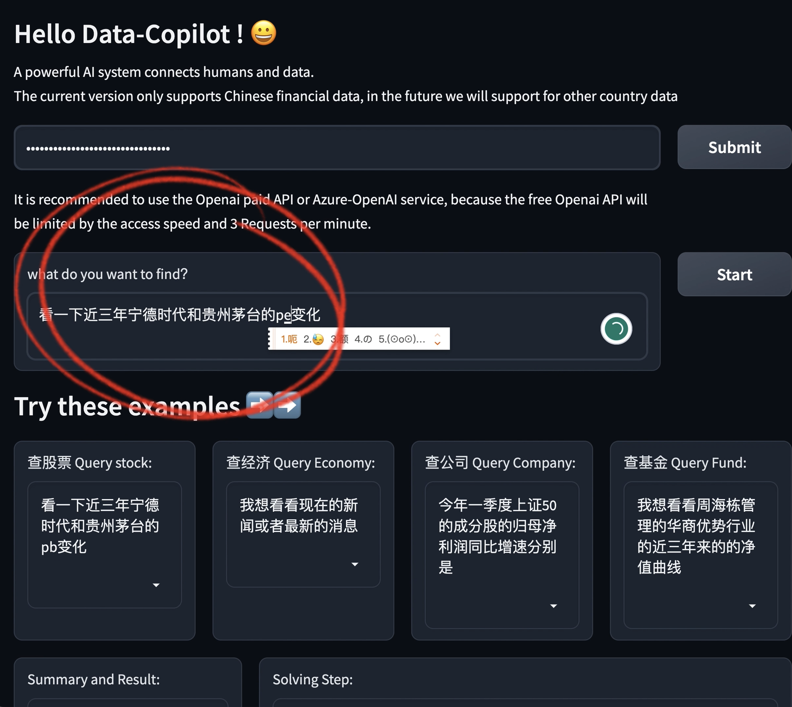
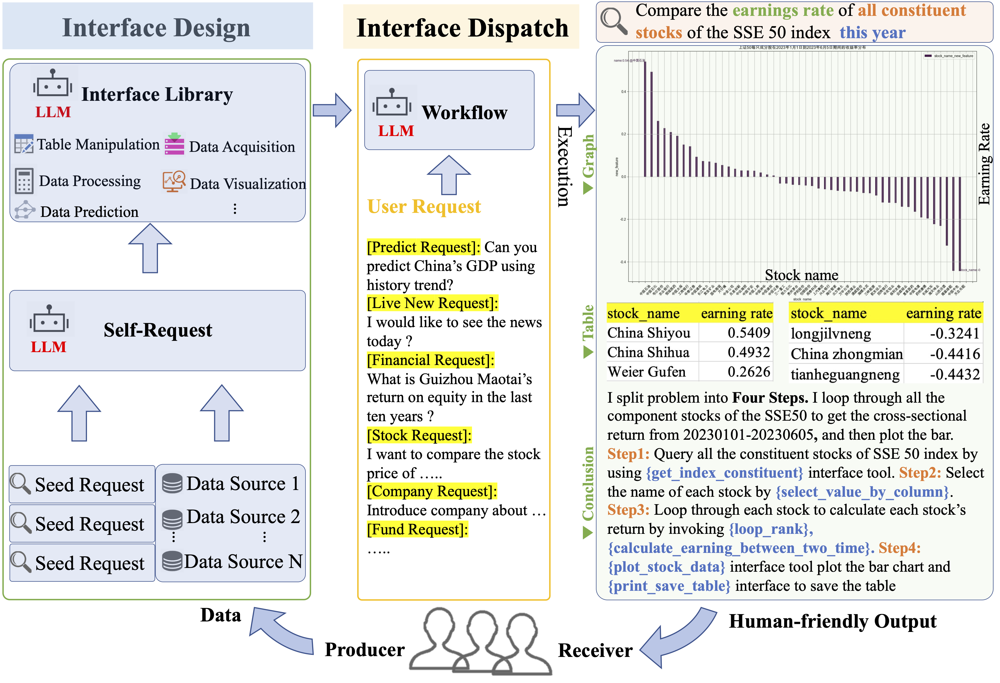
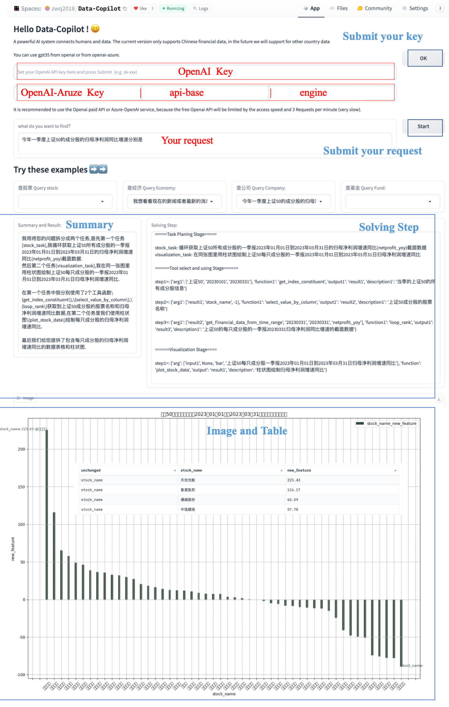
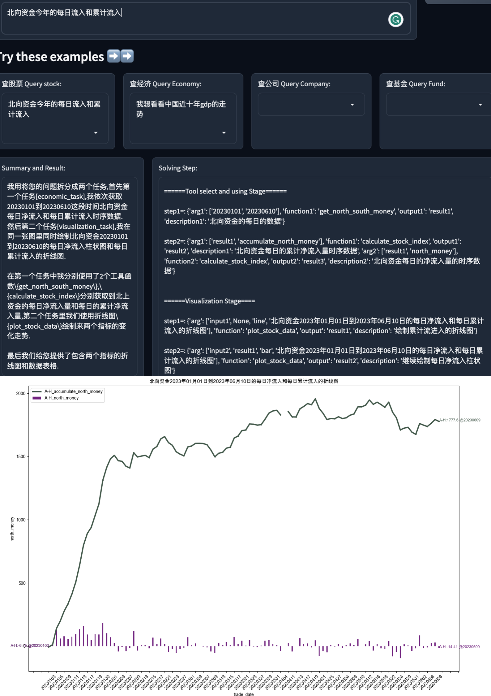

# Data-Copilot

[](https://huggingface.co/spaces/zwq2018/Data-Copilot)
[](https://arxiv.org/abs/2306.07209)
[](https://zhuanlan.zhihu.com/p/636906119)


## Overview
Data-Copilot is a LLM-based system that help you address data-related tasks.  

Data-Copilot connects data sources from different domains and diverse user tastes, with the ability to autonomously manage, process, analyze, predict, and visualize data.


See our paper: [Data-Copilot: Bridging Billions of Data and Humans with Autonomous Workflow](https://arxiv.org/abs/2306.07209), Wenqi Zhang, Yongliang Shen, Weiming Lu, Yueting Zhuang


## 🔥Demo  [video](https://zhuanlan.zhihu.com/p/636906119)
Since gpt3.5 has only a 4k input token limit, it currently can access to Chinese stocks, funds and some economic data.

**The Data-Copilot can query and predict data autonomously**:




Support model and data sources:


|           | CHN Stock |  CHN Fund   |CHN Economic data | CHN Financial data |
|:-------------:|:---------:|:--------:|:---------------:|:------------------------:|
| Openai-GPT3.5 | &#x2713;  | &#x2713; | &#x2713;      |        &#x2713;   |
| Azure-GPT3.5  | &#x2713;  | &#x2713; | &#x2713;      |        &#x2713;   |
| Qwen-72b-Chat | &#x2713;  | &#x2713; | &#x2713;      |        &#x2713;   |




We propose Data-Copilot, an LLM-based system linking Chinese financial markets such as stock, funds, economic, financial data, and live news

* ⭐ Data-Copilot can **autonomously manage, process, analyze, predict, and visualize data**. When a request is received, it transforms raw data into informative results that best match the user’s intent.
* ⭐ Acting as a **designer**: Data-Copilot independently designs versatile interface tools with different functions through self-request and iterative refinement.

* ⭐ As a **dispatcher**: DataCopilot adeptly invokes the corresponding interfaces sequentially or in parallel and transforms raw data from heterogeneous sources into graphics, tables, and text, without human assistance.


## 🌳 QuickStart

First replace openai.key and Tushare token in main.py with your personal Openai key and [Tushare token](https://tushare.pro/).
The organization of the whole project is as follows:
```angular2html
|-- README.md
|-- app.py
|-- create_tool
|   |-- Atomic_api_json.py
|   `-- all_atomic_api.json
|-- lab_gpt4_call.py
|-- lab_llms_call.py
|-- main.py
|-- output
|-- prompt_lib
|   |-- prompt_economic.json
|   |-- prompt_financial.json
|   |-- prompt_fund.json
|   |-- prompt_intent_detection.json
|   |-- prompt_stock.json
|   |-- prompt_task.json
|   `-- prompt_visualization.json
|-- requirements.txt
|-- tool.py
|-- tool_lib
|   |-- atomic_api.json
|   |-- tool_backup.json
|   |-- tool_economic.json
|   |-- tool_financial.json
|   |-- tool_fund.json
|   |-- tool_stock.json
|   `-- tool_visualization.json
```

    
app.py is the file to start gradio. main.py is the processing flow of interface scheduling, and lab_gpt4_call.py is the file to call the GPT35 model.
The tool_lib and tool.py contain the interface tools obtained after the first phase of interface design. 
The folder prompt_lib contains the design of the prompt and the in context demonstration.  
### Requirements
```bash
pip install -r requirements.txt
```


Then run the following command:
### For Local
 ```bash
python main.py
```
You can select the LLM in main.py by setting:
  ```
  model='<the model you choose>'
  ```
Remember to fill in the key of the LLM you chose:
- For GPT, fill in the key of Openai in `main.py`
  ```
  openai_key = os.getenv("OPENAI_KEY")
  ```

- For Qwen-72b-Chat, fill in the key in `lab_llms_call.py`
  ```
  dashscope.api_key='<your api key>'
  ```

Also, remember to fill in the Tushare token before running the code:

In `tool.py` for Tushare token
```angular2html
tushare_token = os.getenv('TUSHARE_TOKEN')
pro = ts.pro_api(tushare_token)
```
### For Gradio
The Gradio demo is now hosted on Hugging Face Space. You can also run the following commands to start the demo locally:
```bash
python app.py
```    
## 🌿 How to play
You can try our Data-Copilot for Chinese financial markets in Hugging Face Space:   

[](https://huggingface.co/spaces/zwq2018/Data-Copilot)
It has access to Chinese stocks, funds and some economic data. But because gpt3.5 only has 4k input token length, the current data access is still relatively small.
In the future, data-copilot will support more data from foreign financial markets.

- **Step 1** Enter your Openai or Openai-Azure key, please try to use openai's paid API. If you plan to use azure's services, please remember to input both api-base and engine, except for key.
- **Step 2** Click the OK button to submit
- **Step 3** Enter the request you want to query in the text box, or select a question directly from the example box and it will appear in the text box.
- **Step 4** Click the Start button to submit the request
- **Step 5** Data-Copilot will display the intermediate scheduling process in the Solving Step, and the final will present text (Summary and Result), images and tables.




## 🍺 Some cases
A case for Check the inflow of northbound every trading date





## Citation

If you find this work useful in your method, you can cite the paper as below:
```
@article{zhang2023data,
  title={Data-Copilot: Bridging Billions of Data and Humans with Autonomous Workflow},
  author={Zhang, Wenqi and Shen, Yongliang and Lu, Weiming and Zhuang, Yueting},
  journal={arXiv preprint arXiv:2306.07209},
  year={2023}
}
```
## Contact 
If you have any questions, please contact us by email:
zhangwenqi@zju.edu.cn
## Acknowledgement

- [ChatGPT](https://platform.openai.com/)
- [Tushare](https://tushare.pro/)
- [Qwen](https://bailian.console.aliyun.com/)

